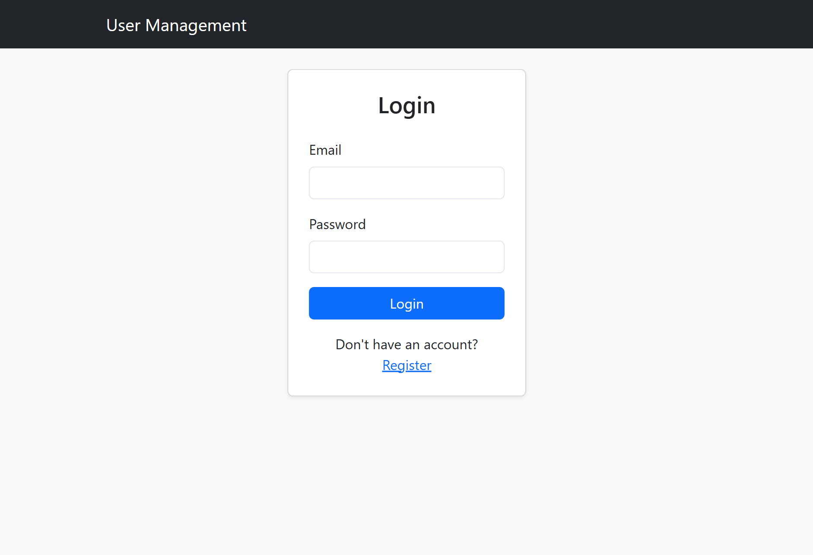
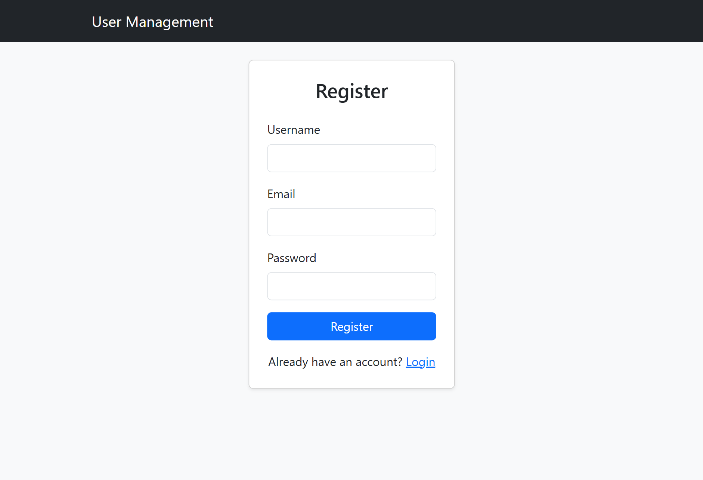
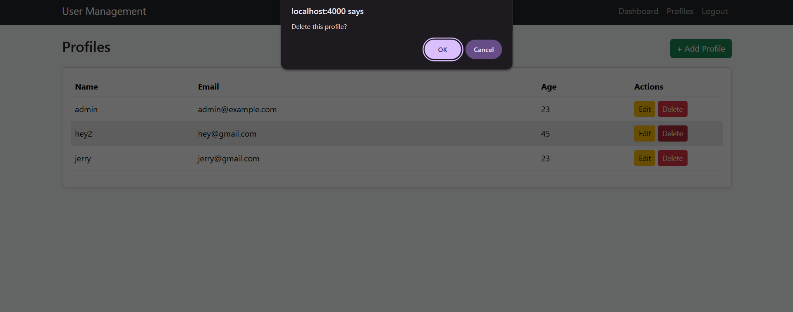
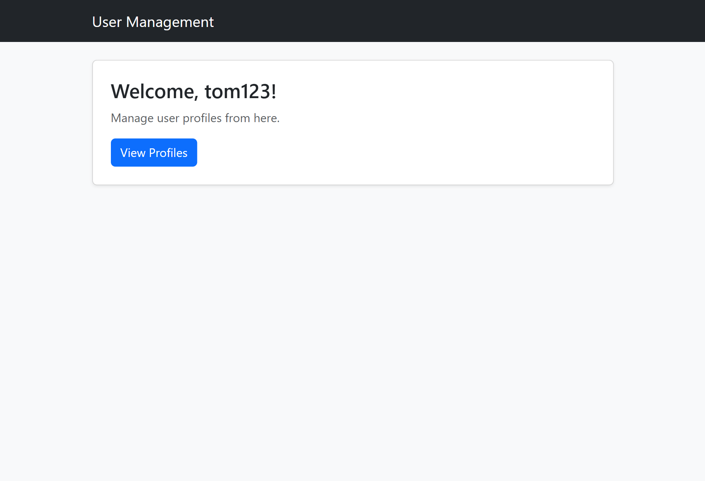
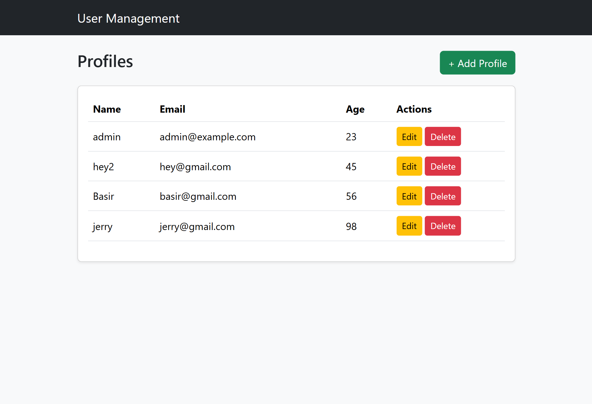
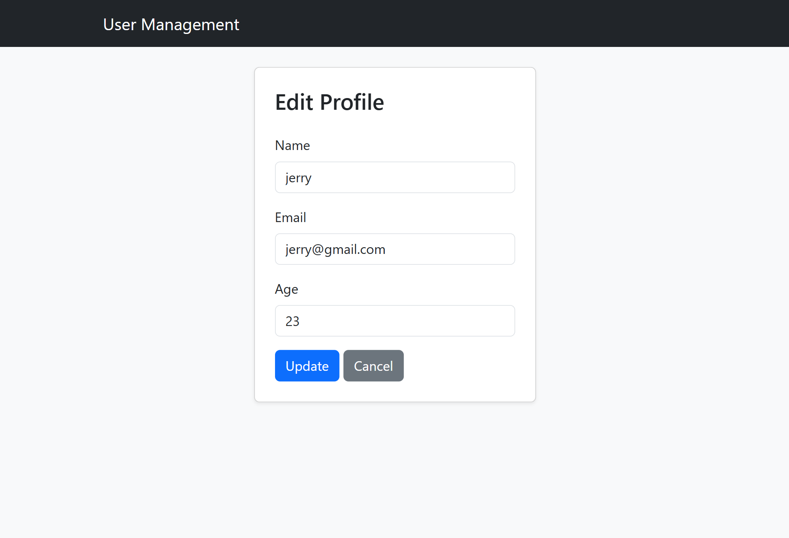

# User Management Web App

A **User Management Web Application** built using **Node.js, Express.js, MongoDB, Mongoose, EJS, and Bootstrap 5**. The application provides secure user authentication and allows authenticated users to perform CRUD (Create, Read, Update, Delete) operations on user profiles.

---

## Features

- User Registration with form validation
- Secure Login and Logout
- Password hashing using **bcrypt**
- Session management using **express-session**
- Create, Read, Update, and Delete user profiles
- Protected routes for authenticated users
- Responsive user interface built with **Bootstrap 5**

---

## Tech Stack

- Node.js
- Express.js
- MongoDB
- Mongoose
- EJS
- Bootstrap 5
- bcrypt
- express-session

---

## Project Structure

```text
project/
│── controllers/
│── middleware/
│── models/
│── routes/
│── views/
│── uploads/
│   ├── dashboard.png
│   ├── login.png
│   ├── register.png
│   ├── profile_dashboard.png
│   ├── profiles.png
│   └── profiles_edit.png
│── db.js
│── app.js
│── package.json
└── README.md
```

---

## Requirements

- Node.js
- MongoDB
- npm (Node Package Manager)

---

## Installation

1. Clone the repository.

2. Install dependencies:

   ```bash
   npm install
   ```

3. Configure your MongoDB connection in `db.js`.

4. Start the application:

   ```bash
   npm start
   ```

5. Open your browser and visit:

   ```
   http://localhost:3000
   ```

---

## Screenshots

### Login



### Register



### Dashboard



### Profile Dashboard



### Profiles



### Edit Profile



---

## Author

Developed by **Sujeet** as a **User Management Web Application** using **Node.js, Express.js, MongoDB, Mongoose, EJS, and Bootstrap 5**.
